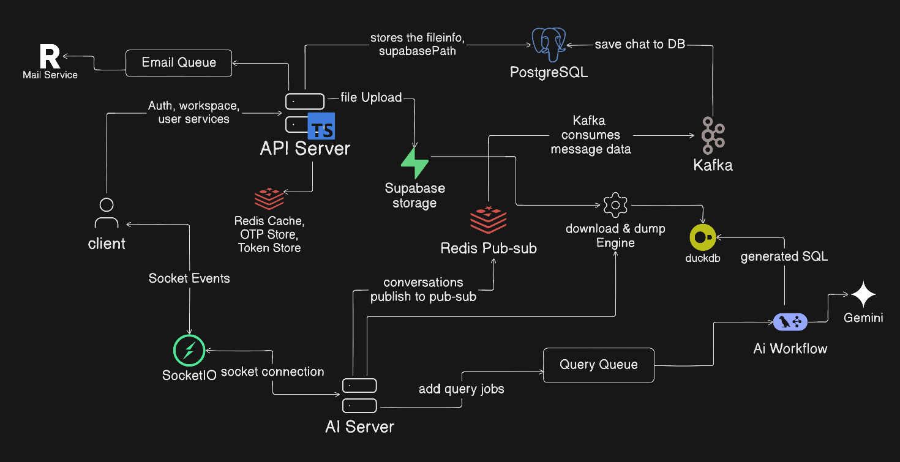
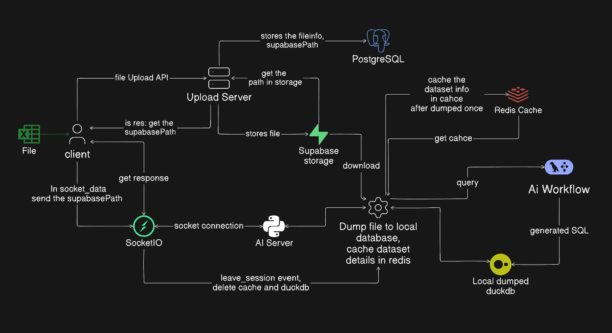

# AI-Powered Marketing Intelligence Platform

A scalable, multi-tenant SaaS platform that enables organizations to interact with their business and marketing data using **natural language** and receive analytical insights through conversational AI and interactive dashboards.

## 🏗️ Architecture

## 🚀 Overview

The platform allows users to ask questions such as:

> "Which marketing campaign generated the highest revenue last quarter?"

The system interprets the question, generates the appropriate SQL query, executes it against structured business data, and returns the result as a conversational response and visual analytics.

It combines **backend engineering, distributed systems, data analytics, and Generative AI** into a single platform.

## ✨ Key Features

* **Natural Language → SQL**

  * Convert business questions into SQL queries using LLMs.
  * Execute analytical queries against structured datasets.

* **AI-Powered Analytics**

  * Conversational querying using Google Gemini.
  * LangChain and LangGraph-based AI workflow orchestration.
  * Context-aware responses.

* **Interactive Dashboard**

  * Visualize query results using charts.
  * Analyze campaign performance, trends, and business metrics.

* **Multi-Tenant Architecture**

  * Workspace-based organization isolation.
  * Role-Based Access Control (RBAC).
  * Workspace member management.
  * Workspace invitation system.

* **Authentication & Security**

  * JWT authentication.
  * OTP-based authentication and email verification.
  * Role-based authorization.
  * Secure workspace-level access control.

* **Persistent Conversations**

  * Store conversation history and session data.
  * Resume previous conversations.
  * Cross-device conversation support.

* **File Upload & Data Processing**

  * Upload business datasets using Supabase.
  * Process uploaded structured data for analytical querying.
  * Redis caching to reduce repeated file-storage operations and improve retrieval performance.

* **Real-Time Communication**

  * Socket.IO-based real-time AI responses.
  * Room-based communication.
  * Live job-status updates.
  * Cross-device chat synchronization.

* **Asynchronous Processing**

  * BullMQ for background jobs.
  * Redis for caching and Pub/Sub.
  * Kafka for event-driven communication.

## 🧠 AI & Data Processing

### Natural Language to SQL

The AI pipeline processes a user's natural-language question and determines the appropriate data required for answering it.

### DuckDB

DuckDB is used as an **analytical query engine for structured datasets**.

Uploaded datasets can be processed into DuckDB databases, allowing analytical SQL queries to be executed efficiently without treating DuckDB as part of the RAG pipeline.

## ⚙️ Technology Stack

### Backend

* Node.js
* Express.js
* TypeScript
* Python
* FastAPI

### Database

* PostgreSQL
* Prisma ORM
* DuckDB

### AI / GenAI

* Google Gemini
* LangChain
* LangGraph
* Qdrant

### Distributed Systems

* Redis
* Kafka
* BullMQ
* Socket.IO

### Storage

* Supabase

### Infrastructure

* Docker
* Docker Compose
* AWS Fargate
* Application Load Balancer
* Nginx

## 🔐 Security

The platform implements:

* JWT authentication
* OTP/email verification
* RBAC
* Workspace-level isolation
* Protected API routes
* Role-based workspace operations
* Secure invitation and membership management

## 📈 Scalability

The architecture uses several mechanisms to support scalable workloads:

* **Redis** for caching and Pub/Sub
* **BullMQ** for asynchronous background processing
* **Kafka** for event-driven communication
* **Socket.IO** for real-time updates
* **Dockerized services** for independent deployment
* Workspace isolation for multi-tenant scalability

## 💡 Engineering Challenges

Some of the major engineering challenges involved:

* Designing multi-tenant workspace isolation.
* Managing asynchronous AI workflows with LangGraph.
* Coordinating background jobs using BullMQ and Redis.
* Implementing event-driven communication using Kafka.
* Maintaining real-time communication across multiple devices.
* Handling persistent conversation state.
* Scaling file-upload and retrieval workflows using caching.
* Managing database relationships and migrations with Prisma.
* Building reliable Natural Language → SQL workflows.
* Containerizing and deploying multiple backend services.

## 🎯 What I Learned

This project provided practical experience in:

* Backend system design
* Distributed systems
* Event-driven architecture
* Database design
* Caching strategies
* Asynchronous processing
* Real-time communication
* Multi-tenant SaaS architecture
* Generative AI integration
* Natural Language to SQL systems
* Cloud deployment and containerization
* Designing scalable backend services